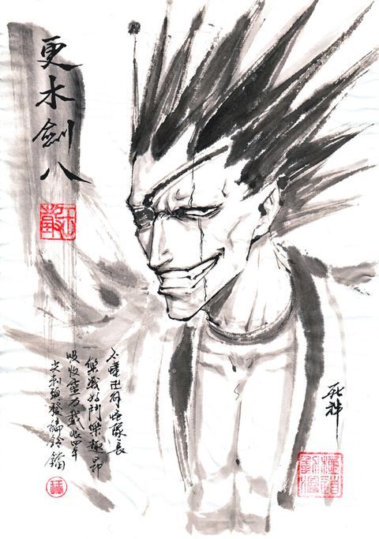

## Hi There!
- 👋 I'm **Wesley Paulo**, 19 years old.
- 📌  From Vitória da Conquista - Ba, BR.
- 💼 Currently Backend Developer at [*Zappts Tecnologia*](https://zappts.com).
- 🎓 Graduated in Analysis and Systems Development at Unopar

### ⚡ Language Stack
- 

### 📦 Frameworks
- 

### 🧰 Tools
- 

### 📈 Statistics and Languages
 

## Contact ✉️
